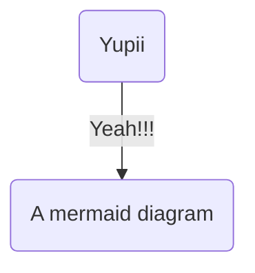

This was one of the tests I did for getting a job in USA !! Nice memories :)

**Feb 14 2025**

Ohh, today I see I can add mermaid diagrams in Git hub ... nice!!



```cs
// This a sample c# code
Console.WriteLine("Fenced code blocks ftw!");
```
# References

- [Include mermaid diagrams in github](https://github.blog/developer-skills/github/include-diagrams-markdown-files-mermaid/)
